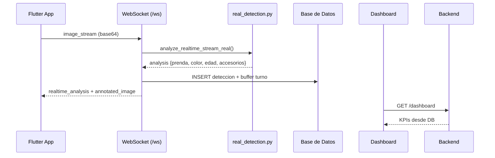

# Arquitectura - NeoTotem AI

## Componentes
```mermaid
flowchart LR
  subgraph Frontend
    F1[Flutter Totem App]
    F2[Visualización Web /dashboard /visualization]
  end

  subgraph Backend[FastAPI]
    R1[Routers API]
    S1[Servicios AI (MediaPipe/OpenCV)]
    S2[Motor Recomendaciones]
    S3[Search/Analytics]
    WS[WebSocket /ws]
  end

  subgraph Datos
    DB[(BD Relacional)]
    IMG[[product_images]]
  end

  F1 -- WebSocket / REST --> WS
  F2 -- REST --> R1
  R1 --> S1
  R1 --> S2
  R1 --> S3
  R1 <--> DB
  S1 --> IMG
```

## Flujo (tiempo real)

