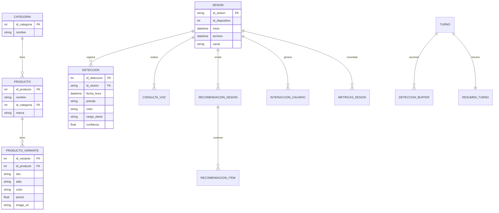

# Modelo de Datos

## Diagrama ER (Mermaid)

```mermaid
erDiagram
  CATEGORIA ||--o{ PRODUCTO : tiene
  PRODUCTO ||--o{ PRODUCTO_VARIANTE : tiene
  SESION ||--o{ DETECCION : registra
  SESION ||--o{ CONSULTA_VOZ : realiza
  SESION ||--o{ RECOMENDACION_SESION : recibe
  RECOMENDACION_SESION ||--o{ RECOMENDACION_ITEM : contiene
  SESION ||--o{ INTERACCION_USUARIO : genera
  SESION ||--o{ METRICAS_SESION : consolida
  TURNO ||--o{ DETECCION_BUFFER : acumula
  TURNO ||--|| RESUMEN_TURNO : resume

  CATEGORIA {
    int id_categoria PK
    string nombre
  }
  PRODUCTO {
    int id_producto PK
    string nombre
    int id_categoria FK
    string marca
  }
  PRODUCTO_VARIANTE {
    int id_variante PK
    int id_producto FK
    string sku
    string talla
    string color
    float precio
    string image_url
  }
  SESION {
    string id_sesion PK
    int id_dispositivo
    datetime inicio
    datetime termino
    string canal
  }
  DETECCION {
    int id_deteccion PK
    string id_sesion FK
    datetime fecha_hora
    string prenda
    string color
    string rango_etario
    float confianza
  }
```

## ORM y SQL
- ORM: `apt-totem-backend/database/models.py`
- Seeds/DDL: `database/sql/`
